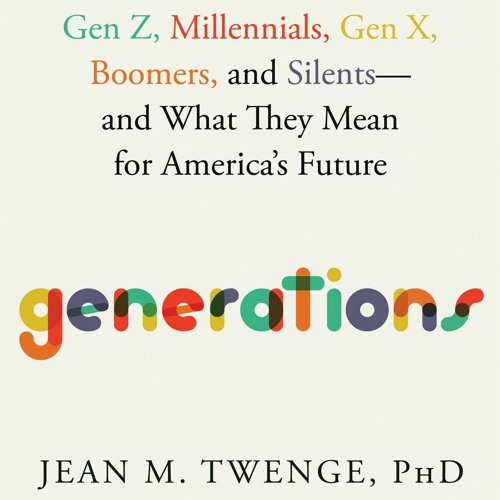
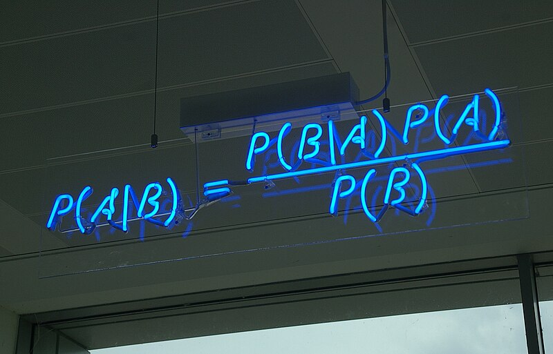
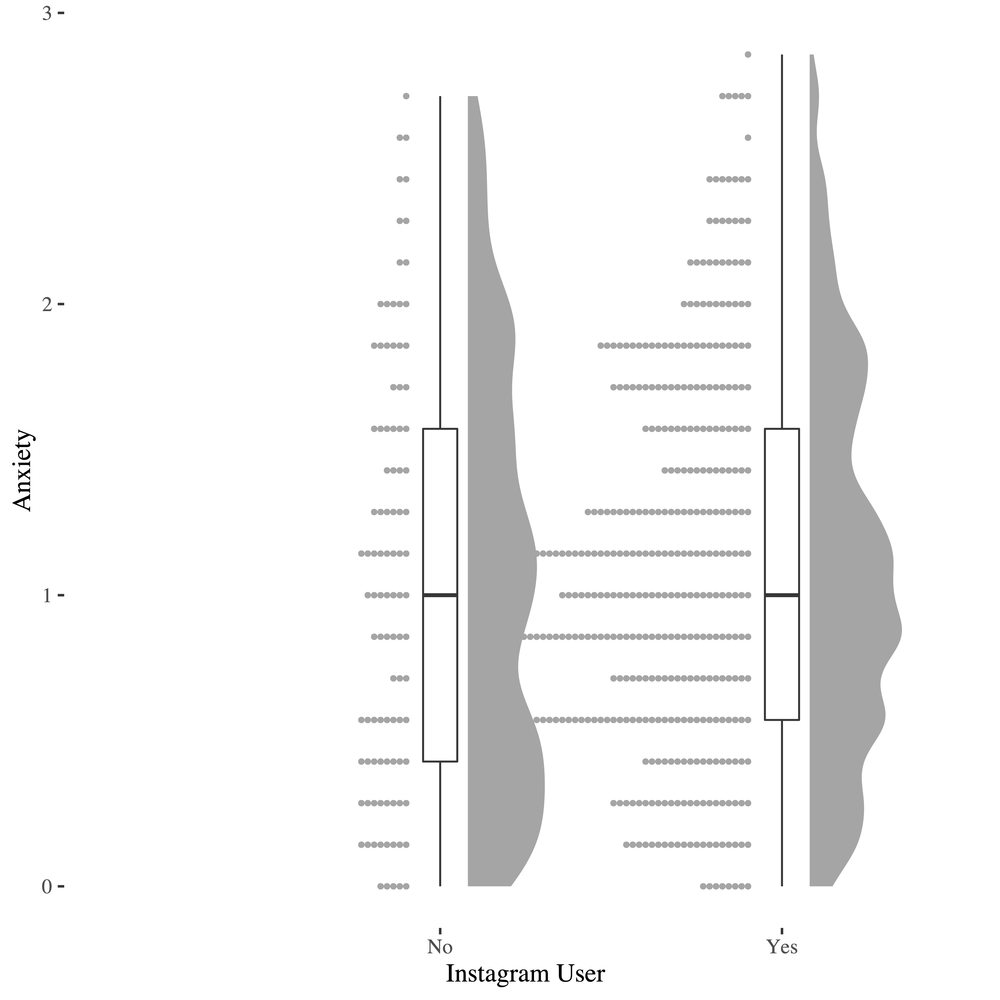
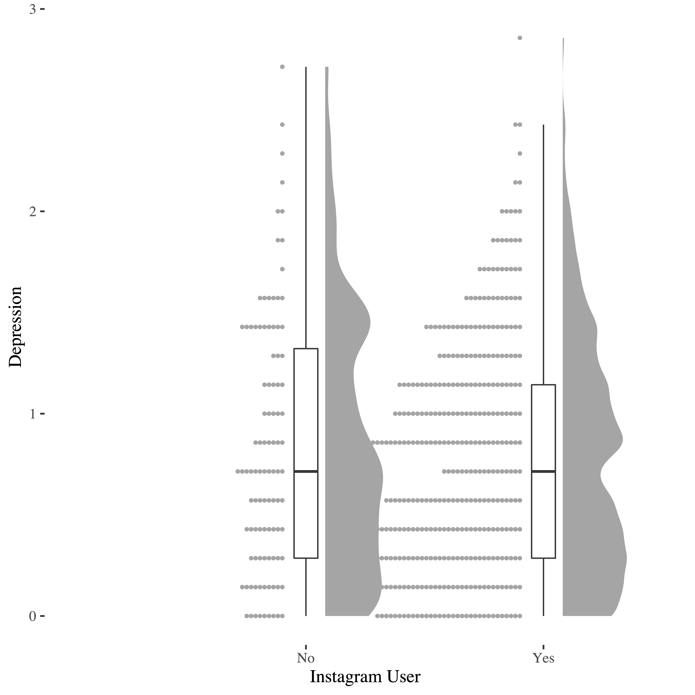
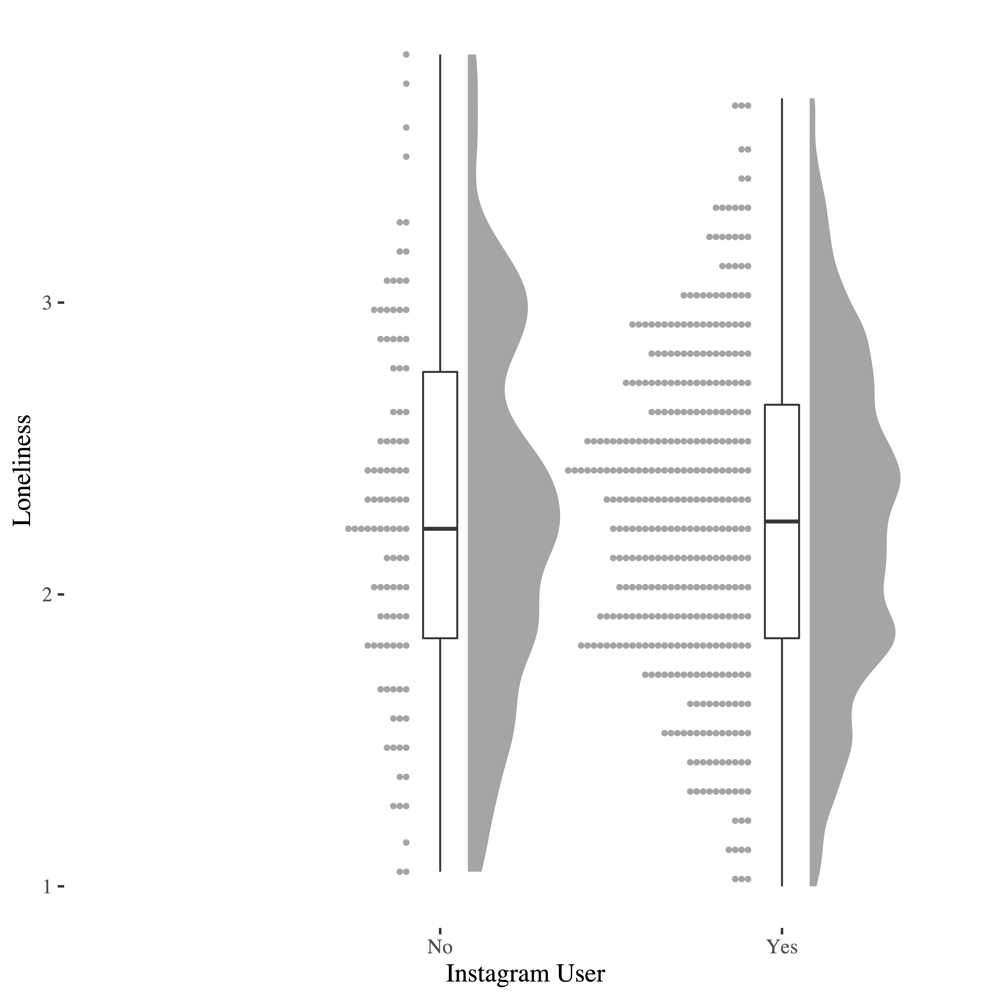
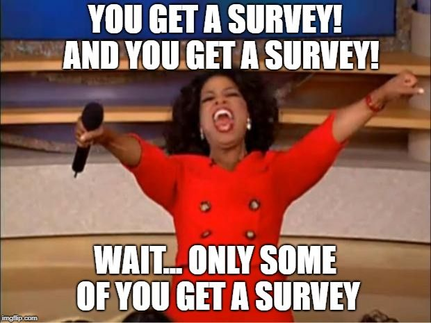
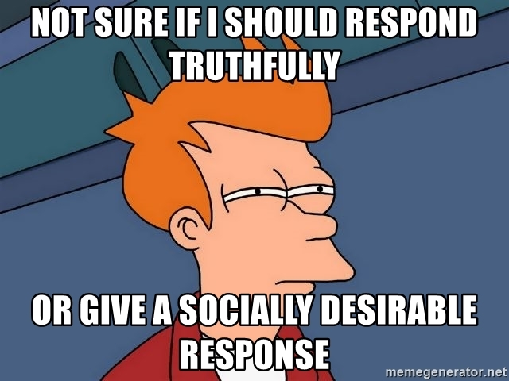

```{r setup, include=FALSE}
options(htmltools.dir.version = FALSE)
knitr::opts_chunk$set(echo = TRUE)
```

```{r echo=F, message=F, warning = F}
require(xaringanExtra) 
require(stargazer)
require(tidyverse)
require(knitr)
require(xfun)
```

```{r xaringan-logo, echo=FALSE}
xaringanExtra::use_logo("NU2.png")
```

```{r xaringan-tile-view, echo=FALSE}
xaringanExtra::use_tile_view()
# Below generates a title slide which allows for a logo.
# Below generates a new class of simulation table, as otherwise it will not fit. (borrowed from other project)
```

```{css, echo=F}
.title-slide {
  background-image: url("BPS.png");
  background-position: 9% 5%;
  background-size: 200px;
  background-color: black;
  padding-left: 100px;  /* delete this for 4:3 aspect ratio */
}
```

```{css, echo = F}
table {
  font-size: 16px;     
}
```

```{css, echo = F}
.simulation table {
  font-size: 7px;     
}
```

```{css, echo = F}
.simulation_small table {
  font-size: 5.9px;     
}
```

```{r load_refs, echo=FALSE, cache=FALSE, warning=F, results='hide', message=F}
# need helper file.
source(here::here("helper.R"))
library(RefManageR)
BibOptions(check.entries = FALSE, 
           bib.style = "authoryear", 
           style = "markdown",
           dashed = TRUE)
file.name <- "references.bib"
bib <- ReadBib(file.name)
```

## Today

* Quick background, but low in theory.

--

* Focus on data.

--

* Findings from a larger study funded by [Facebook Research](https://research.facebook.com/blog/2018/12/announcing-the-winners-of-the-instagram-research-awards-for-social-technologies/). Together with Sam Roberts (LJMU), Connor Malcolm (Northumbria), Kris McCarty (Northumbria).

--

```{r, out.width = "300px", echo=FALSE, fig.align='center'}
knitr::include_graphics("https://media.giphy.com/media/n6ljtq0aO6Zqg/giphy.gif") 
```

---
## Social media: Good or bad... .

Since their inception this has been a debate.


---
## Moral panics


```{r, out.width = "400px", echo=FALSE, fig.align='center'}
 
```

--

`r Citet(bib, "Orben2020")`

???
Even though Twenge also notes that there are positives.

---
## This study

* Previous work convenience samples/student samples (but Instagram has >500 million users who are >35)

--

* Little work comparing users to non-users

--

* Limited work

---
## Method: participants

* 498 participants via Prolific, nationally representative sample based on age/gender (residency). Just before 2020 COVID measures.

--

* 257 women, 236 men, 2 neither male or female, 3 non-disclosures). 

--

* Ages ranged from 19 to 82 years (_M_ = 49.15, _SD_ = 15.53). 

--

* 289 out of 498 participants indicated that they had completed at least a Bachelor level degree.

--

* 375 out of 498 participants indicated that they used Instagram.

```{r, out.width = "300px", echo=FALSE, fig.align='center'}

```

???
58% Ba degree

75% use Insta.

---
## Method: Measures

* Anxiety (Cronbach’s $\alpha$ = 0.87) and depression (Cronbach’s $\alpha$ = 0.83)  (HADS, `r Citet(bib, "Zigmond1983")`). 

--

* Loneliness (Cronbach’s $\alpha$ = 0.94, UCLA, `r Citep(bib, "Russell1980")`)

--

* Instagram use scale (`r Citep(bib, "Yang2016")`): active use (interaction and broadcast) and passive use (browsing). 

Interaction (Cronbach’s $\alpha$ = 0.75), Browsing (Cronbach’s $\alpha$  = .81) and Broadcasting (Cronbach’s $\alpha$ = .83)

???
Unitary construct.
Modified from 1-5 to 1-10. Exploratory factor analysis. 

---
## Matching

* Matching algorithm. [`MatchIt`](https://kosukeimai.github.io/MatchIt/) (`r Citep(bib, "Ho2011")`). 

--

* Full results: pre: [here](pre_.html) and post: [here](post_.html).

--

This generates weights to be used in regression (372 users vs 100 non-users).

```{r, out.width = "550px", echo=FALSE, fig.align='center'}

```

???
genetic matching effect.

From stuart 2010: "the matching on or controlling for the observed covariates also matches on or controls for the unobserved covariates, in so much as they are correlated with those that are observed. Thus, the only unobserved covariates of concern are those unrelated to the observed covariates"

---
## Bayes Factors

* Allows us to quantify evidence for the null hypothesis `r Citep(bib, "Dienes2016","Wagenmakers2007")`.

--

* Qualifications for evidence by `r Citep(bib, "Jeffreys1961")`: BF = 1 - No evidence, 1 < BF <= 3 - Anecdotal, 3 < BF <= 10 - Moderate, 10 < BF <= 30 - Strong, 30 < BF <= 100 - Very strong, BF > 100 - Extreme.

--

```{r, out.width = "500px", echo=FALSE, fig.align='center', fig.alt="Bayes Theorem"}
 # image from: https://commons.wikimedia.org/wiki/File:Bayes%27_Theorem_MMB_01.jpg
```


---
## Procedure

* Full study protocol was preregistered on the [OSF](https://osf.io/twjup)

--

* Embedded in a Social Network Survey in [GENSI](http://www.tobiasstark.nl/GENSI/GENSI.htm). Not discussed here.

---
## Correlations

```{r user_corr, results='asis', echo=FALSE}
xfun::file_string('Use_correl.html')
```

---
## Anxiety

```{r, out.width = "500px", echo=FALSE, fig.align='center', fig.alt="anxiety graph"}

```

---
## Depression

```{r, out.width = "500px", echo=FALSE, fig.align='center', fig.alt="depression graph"}

```

---
## Loneliness

```{r, out.width = "500px", echo=FALSE, fig.align='center'}

```


---
## Users vs. non users

```{r user_table, results='asis', echo=FALSE}
xfun::file_string('Users.htm')
```

???
If anything there users were less anxious, depressed, lonely than non-users.

---
## Bayes Factors

* **Anxiety : 9.41**  

--

* **Depression : 4.01**

--

* **Loneliness: 3.08**

--

This suggests moderate support against the hypothesis that Instagram use is related to mental well-being. 

```{r, out.width = "400px", echo=FALSE, fig.align='center'}
knitr::include_graphics("nothing.gif")
```

---
## Anxiety

* Effect for _Browsing_ at _p_ <.05, but drops out of significance once age is included in the model (_p_ jumps to >.36)

--

* [Full results table](anx_table.html)

--

* Model 1 - Bayes Factor  = 2.78 in favour of effect, but note not longer supported after inclusion of age.

???
Further exploration with a decision tree model from machine learning only showed age as relevant predictor.
Reference categories are female (Gender), Other (Nationality) and A-Level (Education)

---
## Depression

* no sig. effect at _p_ < .05. (all 3 _p_'s > .5)

--

* [Full results table](depression_table.html)

--

* Model 1 - Bayes Factor  = 127.52 in favour of null.

---
## Loneliness

* no sig. effect at _p_ < .05. (all 3 _p_'s > .3)

--

* [Full results table](loneliness_table.html)

--

* Model 1 - Bayes Factor  = 79.68 in favour of null.

---
## Summary

* No support for a difference between users and non-users.

--

* No relationships between type of use and our outcomes. With the exception of anxiety, but this is weak evidence at best, and no longer supported after inclusion of age.

--

In line with some published work finding no relationships....

---
## Limitations

* Representativeness / survivorship bias

```{r, out.width = "600px", echo=FALSE, fig.align='center'}

```


---
## Limitations II

* Measures / Self-reports... 

```{r, out.width = "600px", echo=FALSE, fig.align='center'}

```

---
## Limitations III

* Cross-sectional data: No causality.

```{r, out.width = "600px", echo=FALSE, fig.align='center'}
knitr::include_graphics("correlation_2x.png") # from https://xkcd.com/552/
```

---
## Further research

* Starting to use or leaving instagram.

--

* Actual usage patterns from instagram account.

--

```{r, out.width = "600px", echo=FALSE, fig.align='center'}
knitr::include_graphics("more_more.gif") # from https://xkcd.com/552/
```

---
## Any Questions?

[http://tvpollet.github.io](http://tvpollet.github.io)

Twitter: @tvpollet; Mastodon: @tvpollet@sciences.social 

```{r, out.width = "600px", echo=FALSE, fig.align='center'}
knitr::include_graphics("https://media.giphy.com/media/3ohzdRoOp1FUYbtGDu/giphy.gif")
```

---
## Acknowledgments

* I am greatly indebted to my colloborators. (Any mistakes are my own!). Preprint is [here](https://psyarxiv.com/2583s/)

* This project was funded by [Facebook(/Meta)](https://research.facebook.com/blog/2018/12/announcing-the-winners-of-the-instagram-research-awards-for-social-technologies/). The funder was not involved in the study design, collection, analysis, interpretation of data, the writing of this presentation, or the decision to submit it for this conference.

* slides are built in [Xaringan](https://github.com/yihui/xaringan) and [XaringanExtra](https://pkg.garrickadenbuie.com/xaringanExtra/#/)

* You for listening!

```{r, out.width = "300px", echo=FALSE, fig.align='center'}
knitr::include_graphics("https://media.giphy.com/media/10avZ0rqdGFyfu/giphy.gif")
```

```{r out.width = "200px", echo=FALSE, fig.align='center'}

```

---
## References (errors = blame RefManageR)

```{r, 'refs', results='asis', echo=FALSE, warning=F}
PrintBibliography(bib, start=1, end=5)
```

---
## References II (errors = blame RefManageR)

```{r, 'refs2', results='asis', echo=FALSE, warning=F}
PrintBibliography(bib, start=6, end=10)
```

---
## References III (errors = blame RefManageR)

```{r, 'refs3', results='asis', echo=FALSE, warning=F}
PrintBibliography(bib, start=11, end=15)
```